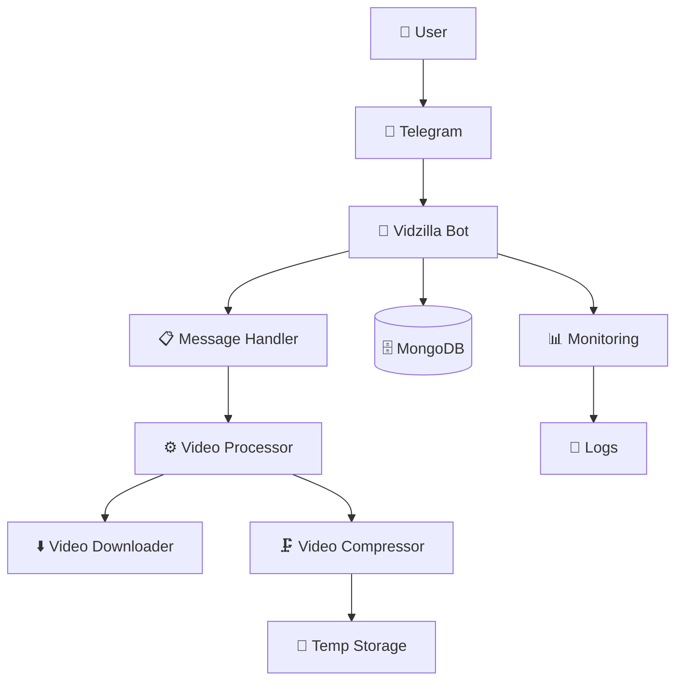
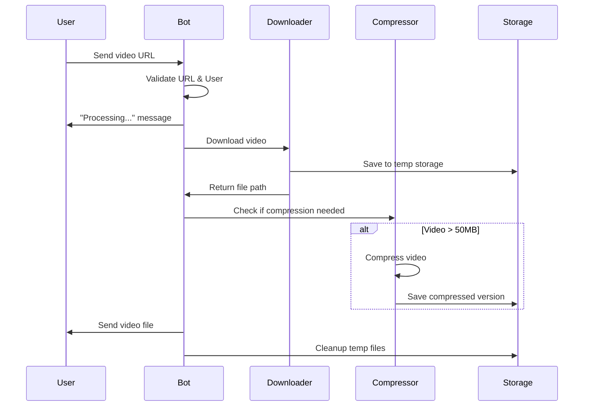
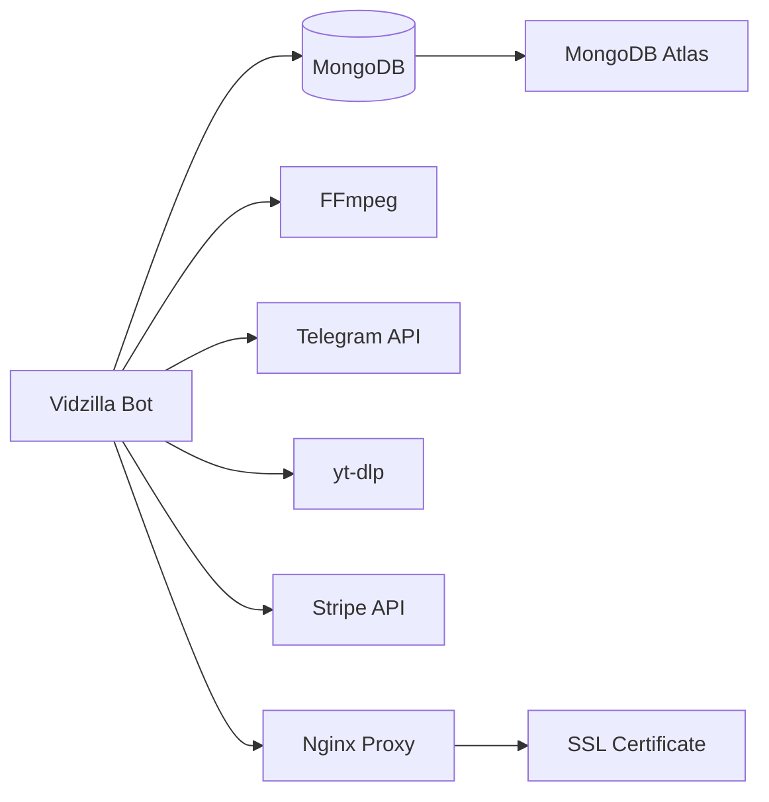

# 🏗️ Architecture Overview / Обзор архитектуры

Подробный обзор архитектуры Vidzilla - от высокоуровневого дизайна до деталей реализации.

## 🎯 High-Level Architecture / Высокоуровневая архитектура



## 🧩 Core Components / Основные компоненты

### 1. Bot Core / Ядро бота
```
bot.py
├── Application setup
├── Handler registration
├── Error handling
├── Graceful shutdown
└── Webhook configuration
```

**Responsibilities / Ответственности:**
- Инициализация Telegram Bot API
- Регистрация обработчиков сообщений
- Управление жизненным циклом приложения
- Глобальная обработка ошибок

### 2. Message Handlers / Обработчики сообщений
```
handlers/
├── handlers.py          # Main message routing
├── admin.py            # Admin commands
└── social_media/       # Platform-specific handlers
    ├── __init__.py
    ├── instagram.py    # Instagram processing
    ├── utils.py        # Common utilities
    └── ...
```

**Key Features / Ключевые функции:**
- URL detection and validation
- Platform identification
- Progress message management
- Fallback handling

### 3. Video Processing Engine / Движок обработки видео
```
utils/
├── video_compression.py     # Core compression logic
├── compression_monitoring.py # Performance monitoring
├── stripe_utils.py         # Payment processing
├── stripe_webhook_handler.py # Stripe webhooks
└── user_management.py      # User data management
```

## 🔄 Request Flow / Поток обработки запросов

### 1. Message Reception / Получение сообщения
```python
@app.message_handler(content_types=['text'])
async def handle_message(message):
    # 1. Validate user permissions
    # 2. Extract and validate URL
    # 3. Identify platform
    # 4. Route to appropriate handler
```

### 2. Video Processing Pipeline / Конвейер обработки видео


### 3. Error Handling & Fallbacks / Обработка ошибок и резервные варианты
```python
try:
    # Primary: Send as video
    await send_video(video_path)
except FileTooLargeError:
    # Fallback 1: Compress and retry
    compressed_path = await compress_video(video_path)
    await send_video(compressed_path)
except CompressionError:
    # Fallback 2: Send as document
    await send_document(video_path)
except Exception:
    # Fallback 3: Send original URL
    await send_message(f"Download failed. Original: {url}")
```

## 🗄️ Data Architecture / Архитектура данных

### MongoDB Collections / Коллекции MongoDB
```javascript
// Users collection
{
  "_id": ObjectId,
  "user_id": 123456789,           // Telegram user ID
  "username": "john_doe",         // Telegram username
  "first_name": "John",           // User's first name
  "downloads_today": 2,           // Daily download count
  "total_downloads": 156,         // Total downloads
  "is_premium": false,            // Premium status
  "premium_expires": null,        // Premium expiration
  "created_at": ISODate,          // Registration date
  "last_active": ISODate          // Last activity
}

// Coupons collection
{
  "_id": ObjectId,
  "code": "PREMIUM2024",          // Coupon code
  "type": "premium_month",        // Coupon type
  "uses_left": 10,               // Remaining uses
  "expires_at": ISODate,          // Expiration date
  "created_by": 987654321,       // Admin who created
  "created_at": ISODate
}
```

### File System Structure / Структура файловой системы
```
temp_videos/
├── compression/           # Temporary compression files
├── downloads/            # Downloaded original files
└── processed/           # Processed/compressed files

logs/
├── bot.log              # Main application logs
├── compression.log      # Video compression logs
├── error.log           # Error logs
└── access.log          # Access logs (if webhook mode)
```

## ⚙️ Configuration Management / Управление конфигурацией

### Configuration Hierarchy / Иерархия конфигурации
```python
# config.py
DEFAULT_SETTINGS = {
    # Base configuration
}

COMPRESSION_SETTINGS = {
    # Video compression parameters
}

MONITORING_SETTINGS = {
    # System monitoring configuration
}

# Environment variables override defaults
# .env file provides instance-specific values
```

### Environment Variables / Переменные окружения
```env
# Core Bot Settings
BOT_TOKEN=                    # Telegram bot token
BOT_USERNAME=                 # Bot username
ADMIN_IDS=                    # Comma-separated admin IDs

# Database Configuration
MONGODB_URI=                  # MongoDB connection string
MONGODB_DB_NAME=              # Database name

# Video Processing
COMPRESSION_TARGET_SIZE_MB=45 # Target compression size
COMPRESSION_MAX_ATTEMPTS=3    # Max compression attempts
COMPRESSION_TIMEOUT_SECONDS=300 # Compression timeout

# External APIs

STRIPE_SECRET_KEY=            # Stripe secret key (optional)
```

## 🔧 Video Compression Architecture / Архитектура сжатия видео

### Progressive Compression Strategy / Стратегия прогрессивного сжатия
```python
class VideoCompressor:
    async def compress_video(self, input_path, target_size_mb):
        """
        Progressive compression with multiple quality levels
        """
        quality_levels = [28, 32, 36, 40]  # CRF values
        resolution_levels = [
            (1920, 1080),  # 1080p
            (1280, 720),   # 720p
            (854, 480),    # 480p
        ]

        for quality in quality_levels:
            for width, height in resolution_levels:
                result = await self._attempt_compression(
                    input_path, quality, width, height
                )
                if result.size_mb <= target_size_mb:
                    return result

        raise CompressionError("Unable to compress to target size")
```

### Compression Monitoring / Мониторинг сжатия
```python
class CompressionStatsTracker:
    def __init__(self):
        self.active_compressions = {}
        self.completed_compressions = []
        self.system_metrics = SystemMetrics()

    async def track_compression(self, file_path, progress_callback):
        # Track compression progress and system resources
        # Log performance metrics
        # Cleanup on completion/failure
```

## 📊 Monitoring & Observability / Мониторинг и наблюдаемость

### Logging Architecture / Архитектура логирования
```python
# Structured logging with different levels
LOGGING_CONFIG = {
    'version': 1,
    'handlers': {
        'file': {
            'class': 'logging.handlers.RotatingFileHandler',
            'filename': 'logs/bot.log',
            'maxBytes': 10485760,  # 10MB
            'backupCount': 5
        },
        'compression': {
            'class': 'logging.handlers.RotatingFileHandler',
            'filename': 'logs/compression.log',
            'maxBytes': 10485760,
            'backupCount': 3
        }
    },
    'loggers': {
        'bot': {'handlers': ['file'], 'level': 'INFO'},
        'compression': {'handlers': ['compression'], 'level': 'DEBUG'}
    }
}
```

### Metrics Collection / Сбор метрик
```python
class SystemMetrics:
    def collect_metrics(self):
        return {
            'cpu_usage': psutil.cpu_percent(),
            'memory_usage': psutil.virtual_memory().percent,
            'disk_usage': psutil.disk_usage('/').percent,
            'active_compressions': len(self.active_compressions),
            'temp_dir_size': self.get_temp_dir_size(),
            'timestamp': datetime.utcnow()
        }
```

## 🔒 Security Architecture / Архитектура безопасности

### Input Validation / Валидация входных данных
```python
class URLValidator:
    ALLOWED_DOMAINS = [
        'tiktok.com', 'instagram.com', 'youtube.com',
        'facebook.com', 'twitter.com', 'x.com'
    ]

    def validate_url(self, url: str) -> bool:
        # 1. URL format validation
        # 2. Domain whitelist check
        # 3. Malicious pattern detection
        # 4. Rate limiting check
```

### User Permission System / Система разрешений пользователей
```python
class UserManager:
    async def check_user_permissions(self, user_id: int):
        user = await self.get_user(user_id)

        # Check daily limits
        if not user.is_premium and user.downloads_today >= FREE_LIMIT:
            raise PermissionError("Daily limit exceeded")

        # Check premium status
        if user.is_premium and user.premium_expires < datetime.utcnow():
            await self.revoke_premium(user_id)

        return user
```

### File System Security / Безопасность файловой системы
```python
class SecureFileHandler:
    ALLOWED_EXTENSIONS = ['.mp4', '.mov', '.avi', '.mkv', '.webm']
    MAX_FILE_SIZE = 2 * 1024 * 1024 * 1024  # 2GB

    def sanitize_filename(self, filename: str) -> str:
        # Remove dangerous characters
        # Limit filename length
        # Add random suffix to prevent conflicts
```

## 🚀 Scalability Considerations / Соображения масштабируемости

### Horizontal Scaling / Горизонтальное масштабирование
```bash
# Multi-instance deployment using systemd
# Create multiple service files for load balancing
sudo systemctl enable vidzilla@1.service
sudo systemctl enable vidzilla@2.service
sudo systemctl start vidzilla@1.service
sudo systemctl start vidzilla@2.service
```

### Resource Management / Управление ресурсами
```python
class ResourceManager:
    def __init__(self):
        self.max_concurrent_compressions = 2
        self.compression_semaphore = asyncio.Semaphore(2)
        self.cleanup_interval = 3600  # 1 hour

    async def acquire_compression_slot(self):
        await self.compression_semaphore.acquire()

    def release_compression_slot(self):
        self.compression_semaphore.release()
```

## 🔄 Deployment Architecture / Архитектура развертывания

### Process Architecture / Архитектура процессов
```python
# Process management with asyncio
async def main():
    # Initialize monitoring
    monitor = SystemMonitor()

    # Start compression worker pool
    compression_pool = CompressionPool(max_workers=2)

    # Run bot with graceful shutdown
    await bot.start_polling()
```

### Service Dependencies / Зависимости сервисов


## 📈 Performance Optimization / Оптимизация производительности

### Async Processing / Асинхронная обработка
```python
class AsyncVideoProcessor:
    async def process_multiple_videos(self, video_urls):
        tasks = []
        for url in video_urls:
            task = asyncio.create_task(self.process_video(url))
            tasks.append(task)

        results = await asyncio.gather(*tasks, return_exceptions=True)
        return results
```

### Caching Strategy / Стратегия кэширования
```python
class VideoCache:
    def __init__(self):
        self.cache = {}
        self.cache_ttl = 3600  # 1 hour

    async def get_cached_video(self, url_hash):
        # Check if video was recently processed
        # Return cached result if available
        # Clean expired entries
```

## 🔗 Integration Points / Точки интеграции

### External APIs / Внешние API
- **Telegram Bot API** - Core bot functionality
- **yt-dlp** - Free video extraction for 1000+ platforms
- **Stripe API** - Payment processing
- **MongoDB Atlas** - Database hosting

### Webhook Integration / Интеграция вебхуков
```python
class WebhookHandler:
    async def handle_telegram_webhook(self, request):
        # Process incoming Telegram updates

    async def handle_stripe_webhook(self, request):
        # Process Stripe payment events
```

---

## 🔗 Related Documentation / Связанная документация

- [🛠️ Installation Guide](Installation-Guide) - Установка и настройка
- [⚙️ Configuration](Configuration) - Детальная конфигурация
- [🧪 Testing Guide](Testing-Guide) - Тестирование
- [🚀 Deployment Guide](Deployment-Guide) - Развертывание
- [📊 Monitoring](Monitoring) - Мониторинг системы
